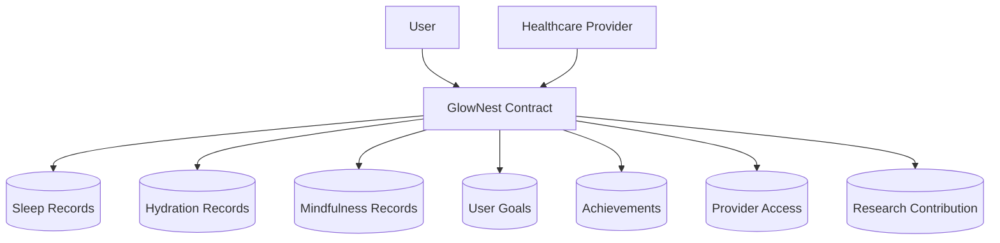

# GlowNest Wellness Tracker

A blockchain-based personal wellness monitoring system built on Stacks, empowering users to securely track their sleep patterns, hydration levels, and mindfulness practices while maintaining complete data ownership.

## Overview

GlowNest Wellness Tracker provides a decentralized platform for tracking personal wellness metrics with the following key features:

- Secure recording of daily sleep, hydration, and mindfulness data
- Achievement-based tracking system for maintaining healthy habits
- Privacy-focused data sharing with healthcare providers
- Optional anonymized data contribution for research
- Goal setting and progress monitoring
- Streak tracking for consistent wellness practices

## Architecture

The system is built around a primary smart contract that manages all wellness data and interactions.



### Core Components:

1. **Data Storage**
   - Sleep metrics (duration, quality, timing)
   - Hydration tracking (daily intake, timestamps)
   - Mindfulness sessions (duration, type)

2. **Achievement System**
   - Streak tracking
   - Milestone recognition
   - Multi-metric achievements

3. **Healthcare Provider Integration**
   - Provider registration
   - Granular access controls
   - Time-limited permissions

## Getting Started

### Prerequisites

- [Clarinet](https://github.com/hirosystems/clarinet)
- Stacks wallet for deployment and testing

### Usage Examples

1. **Record Sleep Data**
```clarity
(contract-call? .glownest-tracker record-sleep 
    u20230615 ;; date
    u480      ;; duration (minutes)
    u8        ;; quality (1-10)
    u2200     ;; sleep time
    u0600     ;; wake time
    none      ;; notes
)
```

2. **Track Hydration**
```clarity
(contract-call? .glownest-tracker record-hydration 
    u20230615 ;; date
    u250      ;; amount in ml
)
```

3. **Log Mindfulness**
```clarity
(contract-call? .glownest-tracker record-mindfulness
    u20230615    ;; date
    u20          ;; duration in minutes
    "meditation" ;; practice type
)
```

## Contract Functions

### Core Data Recording

- `record-sleep`: Log daily sleep metrics
- `record-hydration`: Record water intake
- `record-mindfulness`: Track mindfulness sessions

### Goal Management

- `create-goal`: Set new wellness goals
- `deactivate-goal`: Disable existing goals
- `get-goal`: Retrieve goal information

### Healthcare Provider Integration

- `register-provider`: Register as a healthcare provider
- `grant-provider-access`: Allow provider data access
- `revoke-provider-access`: Remove provider permissions

### Data Retrieval

- `get-sleep-record`: Fetch sleep data
- `get-hydration-record`: Retrieve hydration records
- `get-mindfulness-record`: Access mindfulness data
- `get-achievement-streak`: View achievement progress

## Security Considerations

1. **Data Access**
   - All data access is controlled by the user
   - Provider permissions are time-limited
   - Data compartmentalization prevents unauthorized access

2. **Input Validation**
   - Strict validation for all metric inputs
   - Date format verification
   - Range checking for all values

3. **Privacy Controls**
   - Granular permission system
   - Optional anonymized research participation
   - Provider access expiration

## Development

### Testing

Run the test suite with Clarinet:

```bash
clarinet test
```

### Local Development

1. Start a local Clarinet console:
```bash
clarinet console
```

2. Deploy the contract:
```bash
clarinet deploy
```

### Error Handling

The contract uses defined error codes for common issues:
- `ERR-NOT-AUTHORIZED` (u100): Unauthorized access attempt
- `ERR-INVALID-DATE` (u101): Invalid date format
- `ERR-INVALID-METRICS` (u102): Invalid metric values
- `ERR-ALREADY-RECORDED` (u103): Duplicate record attempt